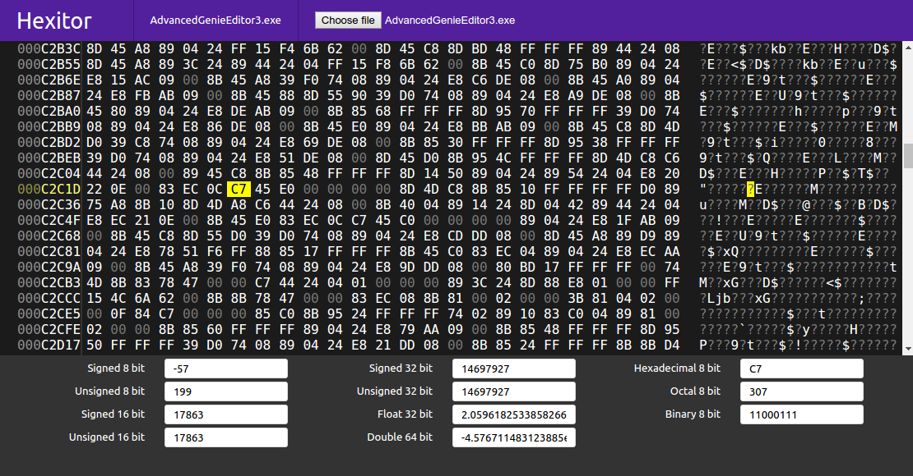

# hexitor

Browser-based hex file viewer.

It's built with [Inferno](https://infernojs.org) and [Redux](http://redux.js.org).

The goal is to have a hex viewer that's really useful for reverse-engineering
file formats. Hopefully one day it'll be fast and quite advanced. See the
[issues](https://github.com/goto-bus-stop/hexitor/issues) for ideas etc.



## Building

After cloning the repository, first run:

```bash
npm install
```

To start a development server ([budo](https://github.com/mattdesl/budo)), run:

```bash
npm run dev
```

By default it runs on localhost port 9966. Note that the development server does
**not** transpile source code, so use a modern browser with ES2015 support.
Hexitor only uses standard ES2015, and
[Hyperscript](https://github.com/terinjokes/inferno-hyperscript) instead of JSX.

For "production" use, run:

```bash
npm run prod
```

That will transpile and minify the source code. The entire thing runs statically
from that point on, so you can put the `index.html` and `bundle.js` files on
a static hosting service like surge.sh and it'll work. `npm start` will start
a static file server if you want to try it out locally.

## License

[MIT](./LICENSE)
